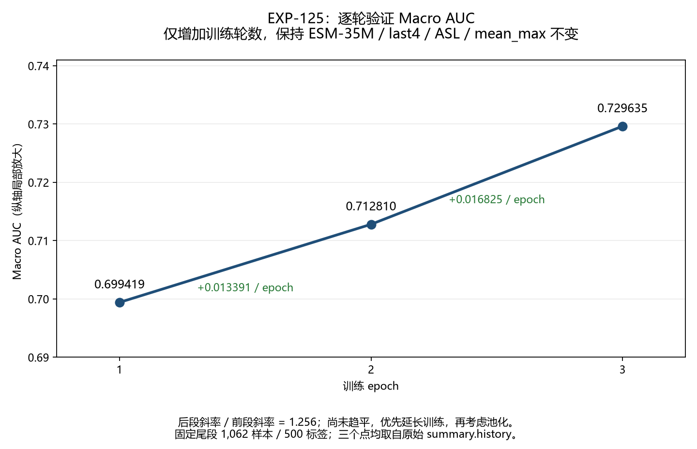

# 第十六次迭代：EXP-125 训练轮数与 AUC 斜率

实验：`EXP-20260930-125-esm35-last4-full-epoch3`。训练于 2026-09-30 23:56:01（原运行机器 UTC+08:00）写出完整 `summary.json`，共完成 3 epoch。本次仅分析已有训练，没有启动新训练或提交。

## 1. 实验目的与控制变量

这是 EXP-117 的单变量轮数对照：训练从 1 epoch 延长至 3 epoch，检验弱排序是否仍受训练轮数不足限制。核心证据是 **epoch1→epoch2、epoch2→epoch3 的验证 Macro AUC 增量**，不是孤立的最终 AUC 或 `best_epoch=3`。

两个配置已逐项比较：除 `experiment_id`、`output_dir` 和 `training.epochs` 外完全相同。

- ESM-2 35M、最后 4 层微调、模型 revision 不变。
- ASL：`gamma_positive=0`、`gamma_negative=1`、`probability_clip=0.05`。
- `mean_max` 池化、1022 残基窗口、128 overlap、512 维分类头不变。
- batch 8、梯度累积 2、head 学习率 0.0005、encoder 学习率 0.00001、seed 42 不变。
- 固定 `iteration4_tail` IDs：112,734 个训练样本、1,062 个验证样本、500 标签；未改动历史 seed-42 IDs。

## 2. 三个真实训练点

三个点均来自本次 `summary.history`。F1 是默认阈值 0.5，不是阈值交叉拟合成绩。

| epoch | 训练 loss | 默认 Macro F1 | 验证 Macro AUC | 较前轮 AUC 增量 |
| --- | ---: | ---: | ---: | ---: |
| 1 | 0.566521883 | 0.143644764 | 0.699419195 | 不适用 |
| 2 | 0.536431954 | 0.153643316 | 0.712810309 | +0.013391114 |
| 3 | 0.520500436 | 0.161852766 | 0.729634841 | +0.016824532 |

- epoch1→epoch3 总增量 **+0.030215646**，平均斜率 **+0.015107823 AUC/epoch**。
- 后段斜率比前段增大 **25.64%**，二阶差分 **+0.003433418**。
- loss 持续下降，默认 F1 持续上升，未观察到 AUC 平台期。

**结论：优先延长训练，尚未轮到把池化作为下一主变量。** 三个点不能证明最终收敛轮数或性能上限，也不保证后续每轮继续改善。

EXP-125 epoch1 与 EXP-117 单轮 AUC 0.699404322 相差约 +0.000014873。本报告斜率仅由 EXP-125 同次训练计算，不用跨实验点拼接曲线。

## 3. 同口径结果登记

对保存的 epoch3 最佳 checkpoint 使用既有协议复核：逐标签精确阈值、selection-fold 内全局 0.02 网格、收缩系数 25、两折预测合并后计算完整验证集 F1。校准 seed 为 17、31、42、73、101；先重新计算 EXP-117，五个 seed 的 F1 与既有审计结果逐项一致。

| 对照 | 五 seed Macro F1 均值 | 标准差（ddof=0） | 连续 Macro AUC |
| --- | ---: | ---: | ---: |
| EXP-117，1 epoch | 0.152413970 | 0.001103489 | 0.699404322 |
| EXP-125，3 epoch 最佳 checkpoint | **0.183681435** | 0.001575651 | **0.729634841** |
| 现行参考 EXP-103 | 0.338247950 | — | 0.824491906 |

EXP-125 校准 F1 较 EXP-117 提升 **+0.031267464**，但仍低于现行参考，不替换 EXP-103。五个 seed 只改变阈值校准二分，不是五次独立模型训练。

默认阈值正例率为 25.79%，校准后五 seed 平均为 13.59%，真实正例率为 5.92%。过预测仍存在，但不把校准调整作为轮数结论的依据。

结果表登记的是 epoch3 最佳 checkpoint 的五 seed 校准 F1 与连续 AUC，不将默认 F1 0.161853 混入同口径趋势。epoch1/2 没有保存各自完整分数，未虚构其校准 F1。训练按默认 Macro F1 选 checkpoint；本次三个 AUC 点也递增，因此 epoch3 同时是已测最高 AUC 点。

## 4. 下一步与续训限制

1. 优先做同配置更长轮数对照，例如 6 epoch；保持池化、loss、学习率和 IDs 不变，使用新实验 ID 和输出目录。
2. 继续记录每轮原始验证 AUC，重点看最新区间斜率；平台期或回落后再安排池化单变量对照。
3. 当前 `model.pt` 仅保存 `model.state_dict()`，没有 optimizer、AMP scaler 或随机状态。**加载权重并重置优化器不是无损续训。** 严格轮数对照应在新实验中从头训练至更长轮数；若接 epoch3 权重，须登记优化器重置这一额外变化。
4. 本次未启动 EXP-124 BCE 对照、池化实验或更长轮数训练，未并发占用 GPU。

## 5. 可核查产物

- 原始历史：`artifacts/runs/EXP-20260930-125-esm35-last4-full-epoch3/summary.json`。
- 最佳模型与分数：同目录 `model.pt`、`validation_scores.npz`，保持本地。
- 分析与复核：`artifacts/metrics/EXP-20260930-125-esm35-epoch-slope-summary.json`。
- 三轮结果表：`artifacts/metrics/EXP-20260930-125-esm35-epoch-slope-history.csv`。
- 五 seed 结果表：`artifacts/metrics/EXP-20260930-125-esm35-epoch-slope-crossfit-seeds.csv`。
- 三点 AUC 图：`artifacts/metrics/EXP-20260930-125-esm35-epoch-slope-auc.png`。
- 迭代登记及整体趋势：`reports/tables/蛋白质功能预测迭代趋势.xlsx`，来源登记在 `configs/iteration_trends_updates_20260930.json`。
