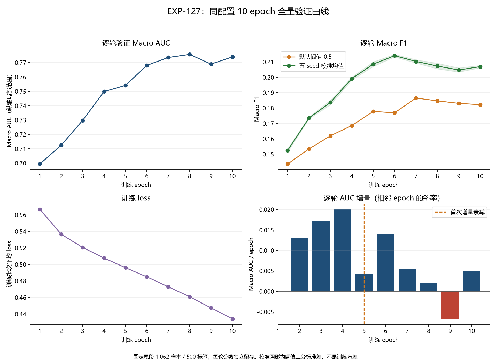

# 第十七次迭代：EXP-127 十轮曲线与平台判断

实验：`EXP-20260930-127-esm35-last4-full-epoch10`。原进程于 2026-10-01 00:38:05 启动，09:21:08 正常退出，exit code 为 0（时间均为运行机器 UTC+08:00）。完成连续 1～10 轮，10 份分数矩阵逐一复算通过；本报告不以 GPU 占用率下降作为结束证据。

**结论：首次 AUC 增量衰减在 epoch5，epoch6 反弹后，epoch7～10 接近平台并有波动。继续无条件加轮不再是优先项。** epoch10 虽较 epoch9 反弹，但没有超过 epoch8；默认与统一校准 F1 的最佳轮次均早于第 10 轮，不能只看最终 AUC 或训练 loss 下结论。

## 1. 实验目的与控制变量

EXP-125 的 3 轮 AUC 增量加速，尚未到平台。本轮使用 `configs/iteration17_esm35_last4_full_epoch10.json`，将总轮数由 3 提到 10，从相同预训练初始化重跑，而非接 epoch3 权重额外训练 10 轮。

配置已逐项比较：除实验 ID、输出目录、总 epoch 数以及仅用于留存分数的 `save_epoch_scores=true` 外，与 EXP-125 完全相同。

- ESM-2 35M，解冻最后 4 层；模型 revision `6fbf070e65b0b7291e7bbcd451118c216cff79d8`。
- 112,734 个训练样本、1,062 个验证样本、500 标签；固定 `iteration4_tail` IDs，seed 42，历史 seed-42 划分不改动。
- ASL：positive gamma 0、negative gamma 1、clip 0.05；不改损失函数。
- `mean_max` 池化、1022 残基窗口、overlap 128、512 维分类头不变。
- batch 8、梯度累积 2、head LR 0.0005、encoder LR 0.00001、AMP 不变。
- 未启动 150M、池化或损失函数对照；没有测试集预测或竞赛提交。

## 2. 全部十轮结果

AUC 与默认阈值 0.5 的 F1 均由每轮独立分数重新计算，与训练历史逐项一致。loss 是训练批次平均损失，**不是 validation loss**。校准 F1 使用同一既有协议对所有轮次计算，不用跨实验点拼接曲线。

| epoch | 训练 loss | 默认 Macro F1 | 验证 Macro AUC | AUC 较前轮增量 | 五 seed 校准 F1 均值 |
| --- | ---: | ---: | ---: | ---: | ---: |
| 1 | 0.566524169 | 0.143583560 | 0.699396161 | 不适用 | 0.152400688 |
| 2 | 0.536427963 | 0.153413083 | 0.712514022 | +0.013117860 | 0.173549544 |
| 3 | 0.520475104 | 0.161880357 | 0.729747247 | +0.017233226 | 0.183598295 |
| 4 | 0.507700891 | 0.168605867 | 0.749784024 | +0.020036777 | 0.199134202 |
| 5 | 0.496035230 | 0.177766267 | 0.754077519 | +0.004293495 | 0.208514452 |
| 6 | 0.484890471 | 0.176903759 | 0.768011665 | +0.013934146 | 0.214032783 |
| 7 | 0.472983363 | 0.186475924 | 0.773507456 | +0.005495790 | 0.210318466 |
| 8 | 0.460880890 | 0.184645962 | 0.775657311 | +0.002149855 | 0.207301208 |
| 9 | 0.447447360 | 0.183027402 | 0.768902160 | −0.006755151 | 0.204744035 |
| 10 | 0.434070956 | 0.182182461 | 0.773922218 | +0.005020058 | 0.206930760 |

## 3. 核心判断：增量衰减而非最终单点

- epoch2～4 的增量为 +0.013118、+0.017233、+0.020037，延续了 EXP-125 所见的早期加速。
- 首次衰减在 epoch5：增量从 +0.020036777 降到 +0.004293495，二阶差分为 −0.015743282。但 epoch6 又增至 +0.013934146，故 epoch5 不能直接当作已收敛。
- epoch7、8 连续减速，epoch9 回落，epoch10 反弹。最近三段增量为 **+0.002149855、−0.006755151、+0.005020058**，均值仅 **+0.000138254 AUC/epoch**；epoch7→10 的净增量为 +0.000414762。
- epoch10 AUC 0.773922218 比 epoch8 最高值低 0.001735093。后段并非严格水平，但已经不呈现稳定、加速的正斜率；仅凭末轮反弹不能推断还需要更多轮数。
- epoch1→10 的 AUC 总增量为 +0.074526057，默认 F1 总增量为 +0.038598900。延长训练有效，但主要收益在更早的轮次。
- loss 十轮持续下降，默认 F1 在 epoch7 达峰后连续三轮下降；统一校准 F1 在 epoch6 达峰后也未再突破。训练损失下降不等于验证泛化继续改善，后段存在过拟合或优化波动的风险。

这是单次训练、固定验证集上的观察，不是多个独立训练 seed 的收敛证明。结论是“接近平台并波动”，不是“已证明完全收敛”；本轮未记录 validation loss，不能据此绘制训练/验证损失间隙。

## 4. F1 口径与 checkpoint 登记

校准协议与 EXP-125 相同：逐标签精确阈值、selection-fold 内全局 0.02 网格、收缩系数 25，两折预测合并。seed 为 17、31、42、73、101，标准差使用 ddof=0。五个 seed 只改变阈值校准划分，**不是五次模型训练，也不是训练方差或置信区间**。

| 选择口径 | epoch | 默认 F1 | 校准 F1 均值 | 校准 F1 标准差 | AUC | 模型状态 |
| --- | ---: | ---: | ---: | ---: | ---: | --- |
| 校准 F1 最高 | 6 | 0.176903759 | 0.214032783 | 0.000841207 | 0.768011665 | 仅有该轮分数 |
| 默认 F1 最高，原保存 checkpoint | 7 | 0.186475924 | 0.210318466 | 0.001120128 | 0.773507456 | 模型与分数保留 |
| AUC 最高 | 8 | 0.184645962 | 0.207301208 | 0.001843532 | 0.775657311 | 仅有该轮分数 |
| 最终轮 | 10 | 0.182182461 | 0.206930760 | 0.000802502 | 0.773922218 | 仅有该轮分数 |

根目录 `model.pt` / `validation_scores.npz` 仍是 **epoch7**，不是最终轮或最高 AUC 的 epoch8。根分数已与 epoch7 独立矩阵逐元素核对；训练源码 SHA256 与启动记录一致。没有事后重选或覆写 checkpoint。

迭代结果表只追加本次实际保留 checkpoint 的同口径成绩：**校准 F1 0.210318466 ± 0.001120128，AUC 0.773507456**。不把 epoch6 的校准 F1 与 epoch8 的 AUC 拼成一个不存在的模型成绩，也不把默认 F1 混入校准 F1 趋势。

该 checkpoint 校准 F1 高于 EXP-125 的 0.183681435，但仍低于既有参考 EXP-103 的 0.338247950，不替换参考。epoch7 默认正例率 22.92%，校准后平均 12.50%，真实正例率 5.92%；决策层仍有可诊断空间，但不能据此保证阈值优化会消除全部差距。

## 5. 下一步建议与限制

1. **不优先无条件继续加轮。** 当前后段平均 AUC 斜率很小、F1 最佳轮次更早。若仍要检验更长训练，应使用新实验 ID、预先规定停止/选择口径并留存完整训练状态，不能只按末轮 AUC 增量判断。
2. **优先复用现有分数做决策层与逐标签诊断。** 对照 epoch6～10 的支持度分层、正例率与排序/F1 变化，解释 AUC 最高和 F1 最高不在同一轮的原因；不以在整份验证集直接拟合阈值的成绩替代交叉拟合。
3. 如果下一步目的是继续提高排序上限，再考虑 **150M 单变量对照**。本轮曲线不能证明换模型一定有效，也没有证明池化或损失函数就是瓶颈；所有新训练均等待用户决定，未自动启动。
4. 每轮保存的是验证分数，不是每轮模型或 optimizer/scaler/RNG 状态。不能恢复 epoch6/8 的模型，也不能宣称从这些轮次无损续训。现有 `model.pt` 的权重加载与优化器重置属于额外变化。
5. 最佳轮次是在同一固定验证集上比较得到，未做独立测试集评估；五 seed 校准标准差不能用作 AUC 轮次差异的显著性证据。

## 6. 证据与产物

- 原历史：`artifacts/runs/EXP-20260930-127-esm35-last4-full-epoch10/summary.json`、`history.json`；两份完整历史一致。
- 本地逐轮矩阵：同目录 `epochs/epoch01-validation_scores.npz` 至 `epoch10-validation_scores.npz`，形状均为 `(1062, 500)`，ID/标签顺序、有限值、范围与 SHA256 均核验。
- 汇总及逐轮 SHA256：`artifacts/metrics/EXP-20260930-127-epoch10-analysis-summary.json`；其中顶层 F1/AUC 属于保存的 epoch7，全部轮次在 `history`。
- 逐轮表：`artifacts/metrics/EXP-20260930-127-epoch10-analysis-history.csv`，包括 AUC 增量、二阶差分、两种 F1 增量及正例率。
- 校准明细：`artifacts/metrics/EXP-20260930-127-epoch10-analysis-crossfit-seeds.csv`，10 轮 × 5 seed，共 50 行。
- 十轮曲线：`artifacts/metrics/EXP-20260930-127-epoch10-analysis-curves.png`。
- 完成登记来源：`configs/iteration_trends_updates_20261001.json`；结果表与分口径整体趋势：`reports/tables/蛋白质功能预测迭代趋势.xlsx`，保留历史与原三张图。
- 训练复现入口：激活兼容 GPU 环境后执行 `python -u -m src.train_esm_finetune --config configs/iteration17_esm35_last4_full_epoch10.json`；复现须使用新的 ID 和输出目录，不重跑到原产物目录。
- 本地分析入口：`artifacts/runs/EXP-20260930-127-epoch-analysis/analyze_epochs.py`；分析只读取既有分数，输出前缀拒绝覆盖。调用需给出 `--root . --config configs/iteration17_esm35_last4_full_epoch10.json --output-prefix <新的分析前缀>`。

`.npz`、模型、启动日志与本地分析回执继续保留在本地；没有生成竞赛提交，也没有自动进行 Git 提交或推送。

## 7. 完成核验

- 每轮矩阵复算 AUC/默认 F1；10 个 SHA256 与分析汇总一致，50 行校准明细的均值/标准差与汇总逐轮一致，报告十轮数字与原指标一致。
- 工作簿先生成 staging 并检查预览，再替换正式文件。原登记表 561 个历史单元格的值、公式与样式不变；仅更新截至日期并追加第 46 行。原样式定义和布局保留，100 标签筛选与随机验证两张无关图的 XML 保持一致，500 标签图新增本次真实成绩。
- 正式工作簿与已核验 staging 文件 SHA256 一致；十轮曲线和新增登记行均已目视检查。
- `tests/test_train_esm_finetune.py` 与 `tests/test_iteration_trends_workbook.py` 共 **13 项通过**；固定划分、EXP-125 配置与训练源码无 Git 差异，产物仍受忽略规则保护。
