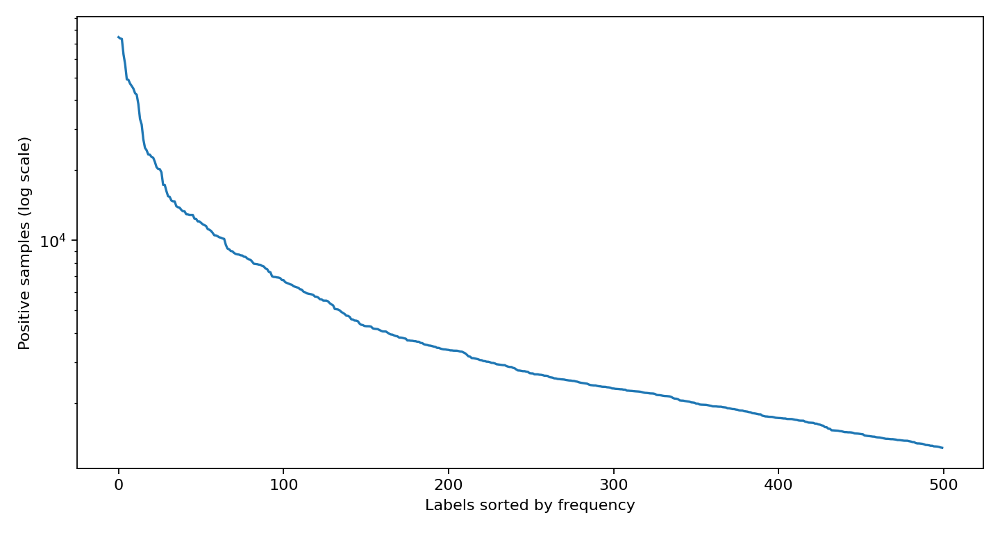
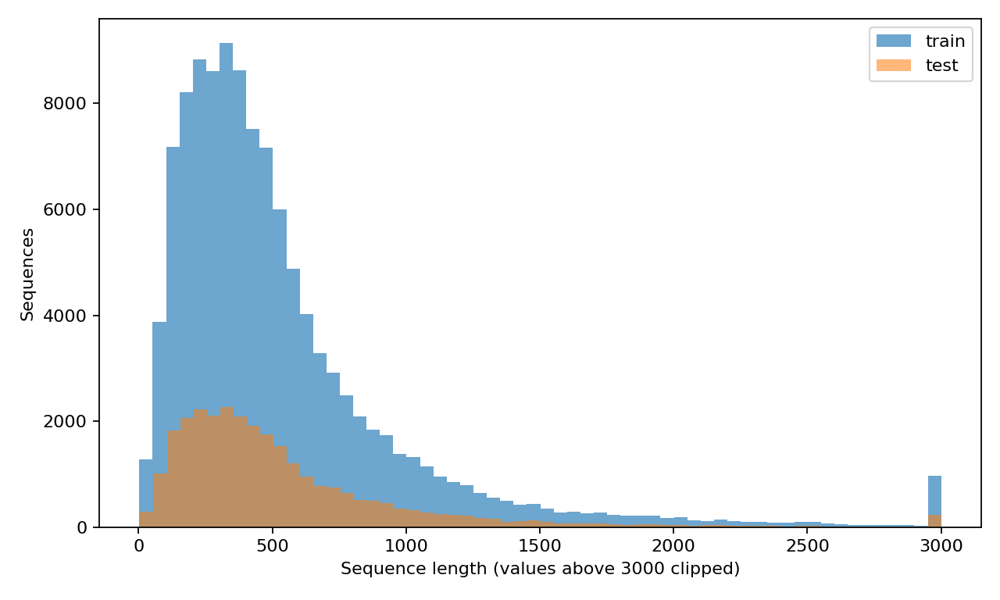
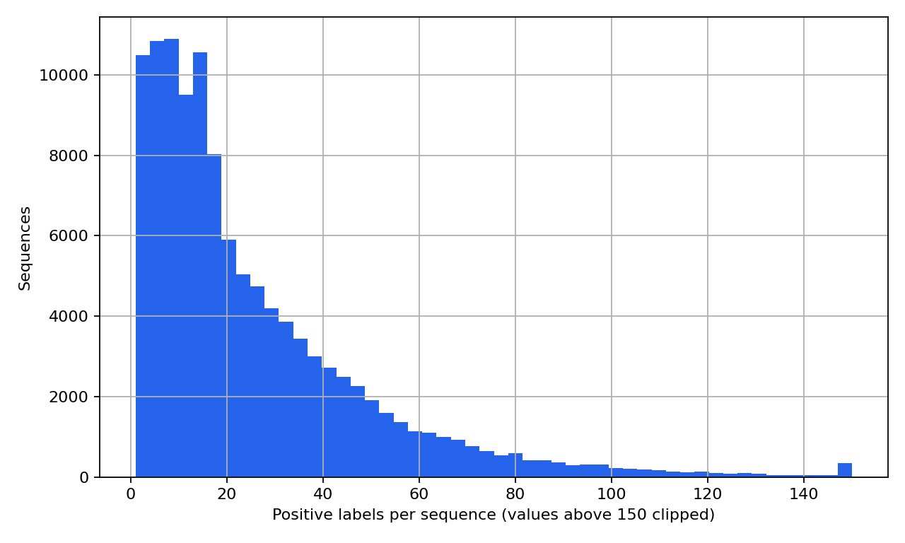
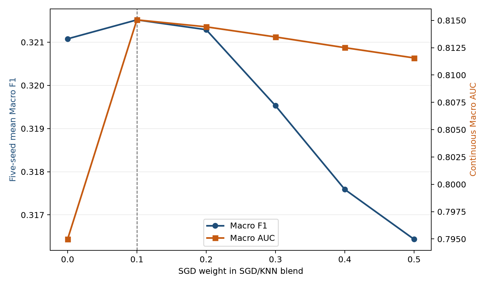
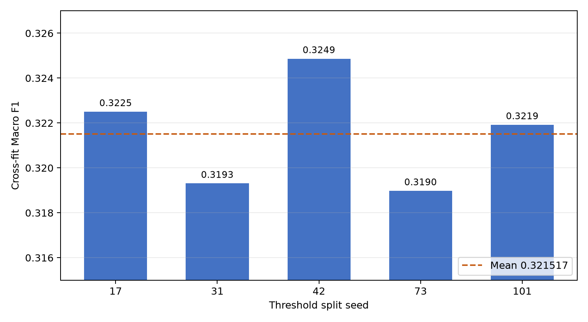

# 蛋白质功能预测综合报告草稿（非最终报告）

> 状态说明（2026-09-26）：本文件是第三次实验期间形成的综合草稿，不作为最终报告。第三次迭代的正式过程记录见 `reports/experiments/EXP-20260926-iteration3.md`。最终综合报告将在全部计划迭代结束、平台成绩回传并完成模型定稿后重新编写。

## 分析结果概要

本项目使用竞赛提供的训练集和测试集完成 500 个蛋白质功能标签的多标签预测。竞赛得分为逐标签 F1 的宏平均，并跳过测试子集中没有正样本的标签。第三次实验因此以 Macro F1 为首要优化目标，同时保留连续 Macro AUC 作为模型排序能力和稳定性的辅助指标。所有训练仅使用竞赛 CSV，不使用外部数据和预训练权重。

数据审计发现，训练集与测试集的 `protein_id` 合并后近似按连续编号覆盖 `P000000` 至 `P142245`，测试样本主要位于 `P112734` 之后，而训练集中该尾段只有 1,062 条有标签样本。固定随机划分不能充分反映这种分布差异。因此第三次实验将尾段带标签样本作为测试分布代理，使用尾段样本加权、尾段交叉验证和序列近邻标签迁移重新选择模型。

最终方案由 120,000 维字符级 3 至 5-mer TF-IDF、balanced SGD 逻辑分类器和稀疏余弦 KNN 组成。SGD 使用尾段样本权重 2，KNN 使用 20 个近邻和相似度平方加权。五个阈值划分 seed 的稳定性筛选表明，SGD 10% 与 KNN 90% 的融合在 F1 和 AUC 之间取得最佳平衡：尾段交叉拟合 Macro F1 均值为 0.321517，标准差为 0.002432，连续 Macro AUC 为 0.815045。最终阈值按标签独立优化 F1，并以支持度收缩强度 10 向全局阈值收缩。

正式模型在全部 113,796 条训练样本上重训，生成 28,450 行、501 列的 `submit_template_v1.csv`。提交文件已通过行列数、标签顺序、测试 ID 顺序、空值、数据类型和二值性检查。最终预测正例率为 11.637%，平均每条测试序列预测 58.19 个标签。

关键词：蛋白质功能预测；多标签分类；Macro F1；k-mer；TF-IDF；近邻迁移；分布偏移

## 第一章  任务与评价指标

### 1.1 任务说明

训练集包含蛋白质编号、氨基酸序列和 `label_0` 至 `label_499` 共 500 个二值功能标签。测试集只提供蛋白质编号与序列，要求输出每个测试样本在 500 个标签上的 0 或 1 预测。正式提交列顺序必须与模板一致，首列为 `protein_id`。

本项目遵守竞赛规则，仅使用竞赛提供的 CSV 文件。模型不调用外部数据库，不下载蛋白质预训练权重，也不引入人工标签。CUDA 环境仅用于可选的本地实验，最终方案的 SGD 和稀疏 KNN 可在 CPU 上复现。

### 1.2 Macro F1

对第 j 个标签，F1 定义为 F1_j = 2TP_j / (2TP_j + FP_j + FN_j)。竞赛先分别计算每个标签的 F1，再跳过测试子集中没有正样本的标签，最后取算术平均。该指标对每个有效标签赋予相同权重，因此稀有标签不会被高频标签掩盖，阈值选择也会直接影响最终排名。

连续 Macro AUC 不依赖二值阈值，可衡量正例排序能力，但不是排行榜主指标。本实验采用“Macro F1 第一，Macro AUC 第二，跨 seed 稳定性第三”的选择规则。阈值仅以 F1 为目标优化；当不同模型的 F1 接近时，再参考 AUC 和标准差。

## 第二章  数据审计与分布发现

### 2.1 数据规模

训练集包含 113,796 行和 500 个标签，测试集包含 28,450 行。训练标签总体正例率为 5.085%，每条训练序列平均具有 25.42 个标签，中位数为 17。全部 500 个标签在训练集中都有正样本。

表2.1  数据规模与提交要求

| 项目 | 数值 | 说明 |
| --- | ---: | --- |
| 训练样本 | 113,796 | 含序列与 500 标签 |
| 测试样本 | 28,450 | 含序列，无标签 |
| 标签数 | 500 | `label_0` 至 `label_499` |
| 训练正例率 | 5.085% | 全部样本标签单元格 |
| 正式提交形状 | 28,450 × 501 | ID 列加 500 标签列 |

### 2.2 测试分布偏移

训练与测试 ID 合并后近似覆盖连续区间 `P000000` 至 `P142245`。测试样本集中于 `P112734` 之后，而训练集中同一区间只有 1,062 条带标签样本。进一步比较发现，早段与尾段在标签频率和序列长度上存在差异。由随机 seed 42 得到的普通分层验证集能够保证历史实验可比，但可能高估对线上测试分布的泛化能力。

第三次实验保留 `artifacts/metrics/splits/seed42/` 中的固定划分，不覆盖历史指标；同时新增尾段代理验证，用于第三次实验内部的模型选择。尾段指标与历史随机验证指标口径不同，不能直接把绝对分数作为同一排行榜比较，但更接近测试集的 ID 分布。

## 第三章  方法设计

### 3.1 k-mer TF-IDF 与 SGD

字符级 3 至 5-mer 能表示局部氨基酸模式，并自然支持不同长度的序列。TF-IDF 通过降低常见片段的权重、提高区分性片段的权重形成高维稀疏表示。最终向量器使用 `min_df=5`、最大词表 120,000 和次线性词频。

每个标签训练一个 SGD 逻辑分类器。模型使用 `class_weight="balanced"`、正则系数 `alpha=5×10^-6`、最大迭代 50 和 seed 42。为提高对测试分布的适应性，ID 位于 `P112734` 之后的带标签训练样本权重设为 2，其余样本权重为 1。

### 3.2 稀疏余弦 KNN 标签迁移

SGD 擅长从大量 k-mer 特征中学习全局线性边界，但序列相似的蛋白质往往共享部分功能标签。第三次实验增加基于同一 TF-IDF 空间的余弦近邻预测：每个查询样本选择 20 个最近训练样本，将余弦相似度平方后作为权重，对邻居标签求加权平均。

KNN 不使用外部数据库，其知识完全来自竞赛训练集。尾段 OOF 计算时，待评估尾段样本不会出现在自身的近邻训练集合中，避免标签泄漏。

### 3.3 F1 阈值与支持度收缩

对每个标签在 0.02 至 0.98 的候选网格上搜索 F1 最优阈值。低支持度标签的最优阈值对划分敏感，因此将逐标签阈值向全局阈值收缩。若标签支持度为 n、收缩强度为 s，则标签阈值权重为 n / (n + s)。最终稳定性实验选择 s=10，全量尾段拟合得到的全局阈值为 0.12。

阈值泛化性能通过双向交叉拟合计算：一半样本拟合阈值并预测另一半，再交换两折。最终模型选择重复使用 seed 17、31、42、73 和 101，按五次 Macro F1 均值排序。

## 第四章  第三次实验过程

### 4.1 尾段权重与特征容量

初始筛选比较尾段权重 1、2、4、8。按早期 AUC 辅助口径，较大的权重在单次划分中有波动，但多 seed 稳定性更支持权重 2。随后将词表从 120,000 扩展到 200,000，并尝试把 3-mer 与 4 至 5-mer 分块建模，两种方案均未形成稳定提升，因此最终保留单一 120,000 词表。

表4.1  尾段代理实验的代表性结果

| 方案 | Cross fit Macro F1 | 连续 Macro AUC | 结论 |
| --- | ---: | ---: | --- |
| 120k 词表，尾段权重 2 | 0.311563 | 0.803188 | 保留作为 SGD 主模型 |
| 200k 词表，尾段权重 2 | 0.315226 | 0.805665 | 计算增大，收益不稳定 |
| 分块 3-mer 与 4-5-mer | 0.313217 | 0.801092 | 未超过单一词表 |

### 4.2 SGD 与 KNN 融合

完整 500 标签尾段 OOF 显示，SGD 与 KNN 的误差具有互补性。在旧的 AUC 导向比较中，50% SGD 与 50% KNN 的连续 Macro AUC 为 0.811565，交叉拟合 Macro F1 为 0.316007。纯 KNN 的交叉拟合 Macro F1 可达到 0.321946，但连续 AUC 只有 0.794971，说明少量 SGD 分数有助于保持排序质量。

在明确排行榜采用 Macro F1 后，实验重新扫描 SGD 权重 0% 至 50% 和阈值收缩强度。五 seed 稳定性结果最终选择 10% SGD 与 90% KNN，Macro F1 均值 0.321517，连续 Macro AUC 0.815045。该组合的 F1 与纯 KNN 接近，同时显著提高 AUC，因此更适合作为最终稳健方案。

表4.2  F1 稳定性筛选前列组合

| SGD 权重 | KNN 权重 | 收缩强度 | 五 seed Macro F1 均值 | 标准差 | 连续 Macro AUC |
| ---: | ---: | ---: | ---: | ---: | ---: |
| 10% | 90% | 10 | 0.321517 | 0.002432 | 0.815045 |
| 10% | 90% | 15 | 0.321396 | 0.002366 | 0.815045 |
| 20% | 80% | 5 | 0.321290 | 0.002234 | 0.814409 |
| 0% | 100% | 10 | 0.321078 | 0.001261 | 0.794971 |

## 第五章  最终模型与正式提交

### 5.1 最终配置

表5.1  最终训练配置

| 模块 | 最终设置 |
| --- | --- |
| 特征 | 3 至 5-mer TF-IDF，120,000 维，`min_df=5` |
| SGD | balanced，`alpha=5×10^-6`，尾段权重 2 |
| KNN | 20 邻居，余弦相似度平方加权 |
| 融合 | SGD 10%，KNN 90% |
| 阈值 | 逐标签 F1 网格搜索，收缩强度 10 |
| 全局阈值 | 0.12 |
| 随机种子 | 模型 seed 42；阈值稳定性 5 seeds |

全量特征矩阵包含 113,796 × 120,000 的训练稀疏矩阵和 28,450 × 120,000 的测试稀疏矩阵。训练矩阵非零元素数为 111,774,787，测试矩阵非零元素数为 28,081,159。特征构建耗时约 198.59 秒，500 标签 SGD 拟合与推理约 1,802.13 秒，测试集 KNN 推理约 1,166.06 秒。

### 5.2 提交验证

正式提交位于 `artifacts/submissions/EXP-20260926-045-iteration3-final-f1-primary/submit_template_v1.csv`。项目验证器和独立检查均通过。

表5.2  正式提交检查结果

| 检查项 | 结果 |
| --- | --- |
| 行数 | 28,450，通过 |
| 列数 | 501，通过 |
| 测试 ID 顺序 | 与 `data/test.csv` 完全一致 |
| 标签值 | 仅包含整数 0 和 1 |
| 空值 | 0 |
| 标签列数 | 500 |
| 预测正例率 | 11.637% |
| 平均预测标签数 | 58.19 |

预测标签数高于训练集均值 25.42，原因是尾段代理验证中 F1 最优阈值偏低，且 KNN 会对相似邻居共享的多个标签给出中等分数。该结果由严格的尾段交叉拟合选择，而不是手工修改。线上得分回传后，应优先检查预测密度是否与测试集真实标签密度匹配，并据此决定是否提高阈值收缩或增加预测标签数约束。

## 第六章  结果讨论

第一，随机验证与测试分布代理解决的是不同问题。历史固定 seed 42 结果用于不同迭代的可比性，尾段 OOF 用于第三次实验的线上泛化选择。两种分数不应直接混为同一验证排行榜。

第二，Macro F1 与 AUC 可以兼顾，但优先级必须明确。AUC 高不保证阈值后的 F1 高；纯 KNN 在 F1 上有竞争力，但排序能力明显较低。最终 10% SGD 融合在不牺牲 F1 的情况下提高 AUC，是本轮最符合竞赛目标的折中。

第三，低支持度标签是主要不确定性来源。逐标签阈值能提高拟合 F1，但也容易受少量正例影响。支持度收缩和多 seed 复核降低了这种偶然性，仍不能完全替代线上反馈。

第四，简单扩大词表并未稳定提分。当前收益主要来自验证分布设计、近邻标签迁移和 F1 阈值，而不是单纯增加特征容量。后续若继续迭代，应优先研究近邻候选过滤、按标签自适应融合和预测密度校准。

## 第七章  结论

第三次实验围绕排行榜 Macro F1 重新校准了训练和选择流程。最终方案不使用外部数据或预训练权重，通过尾段分布代理、样本加权、k-mer SGD、序列 KNN 标签迁移、逐标签 F1 阈值和多 seed 稳定性筛选形成完整提交。

本地最重要的最终指标为：五 seed 尾段交叉拟合 Macro F1 均值 0.321517，标准差 0.002432，连续 Macro AUC 0.815045。正式 `submit_template_v1.csv` 已通过全部结构与取值校验，可用于竞赛平台提交。由于本地尾段只有 1,062 条样本，线上 Macro F1 仍是判断分布代理是否有效的最终依据。

## 参考文献

[1] The UniProt Consortium. UniProt: the Universal Protein Knowledgebase in 2023[J]. Nucleic Acids Research, 2023, 51(D1): D523-D531.

[2] The Gene Ontology Consortium. The Gene Ontology knowledgebase in 2023[J]. Genetics, 2023, 224(1): iyad031.

[3] Radivojac P, Clark W T, Oron T R, et al. A large-scale evaluation of computational protein function prediction[J]. Nature Methods, 2013, 10: 221-227.

[4] Sechidis K, Tsoumakas G, Vlahavas I. On the stratification of multi-label data[C]//Machine Learning and Knowledge Discovery in Databases. Berlin: Springer, 2011: 145-158.

[5] Lipton Z C, Elkan C, Naryanaswamy B. Optimal thresholding of classifiers to maximize F1 measure[C]//Machine Learning and Knowledge Discovery in Databases. Berlin: Springer, 2014: 225-239.

[6] Bottou L. Large-scale machine learning with stochastic gradient descent[C]//Proceedings of COMPSTAT. Heidelberg: Physica-Verlag, 2010: 177-186.

[7] Salton G, Buckley C. Term-weighting approaches in automatic text retrieval[J]. Information Processing and Management, 1988, 24(5): 513-523.

[8] Tsoumakas G, Katakis I. Multi-label classification: An overview[J]. International Journal of Data Warehousing and Mining, 2007, 3(3): 1-13.

[9] Pedregosa F, Varoquaux G, Gramfort A, et al. Scikit-learn: Machine learning in Python[J]. Journal of Machine Learning Research, 2011, 12: 2825-2830.
