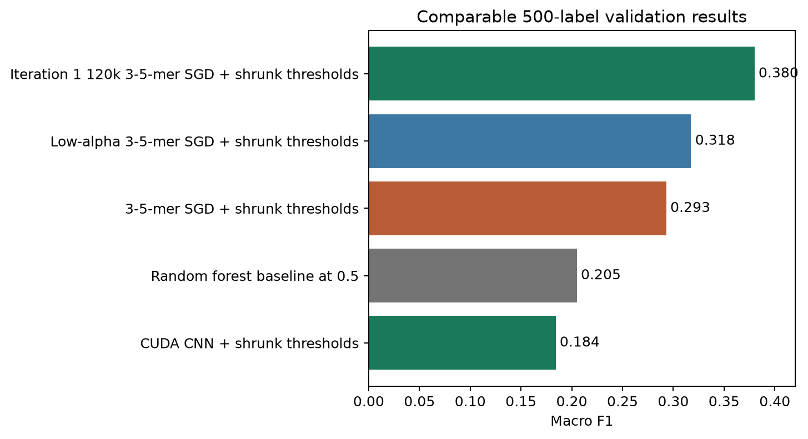
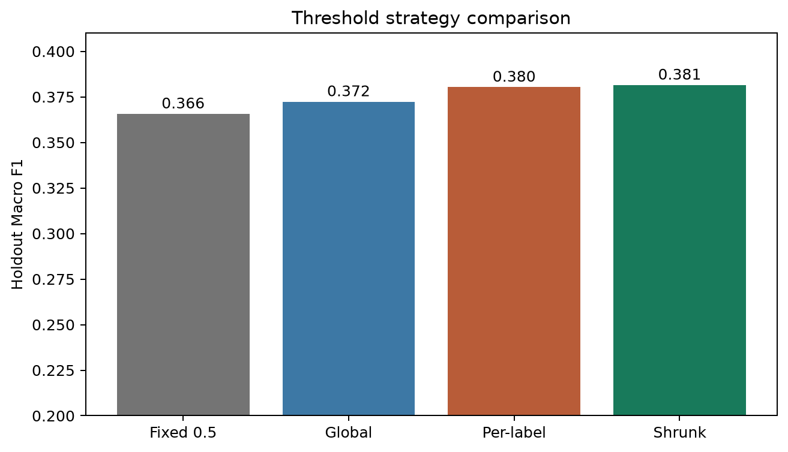
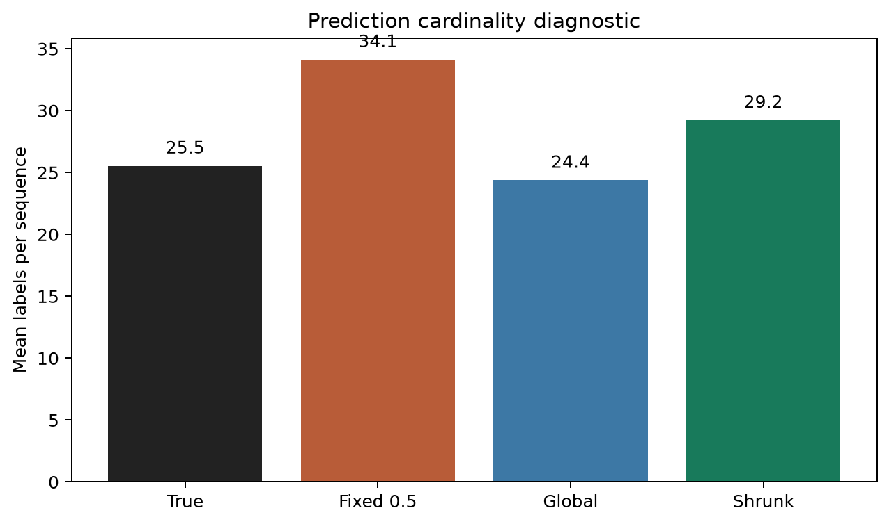
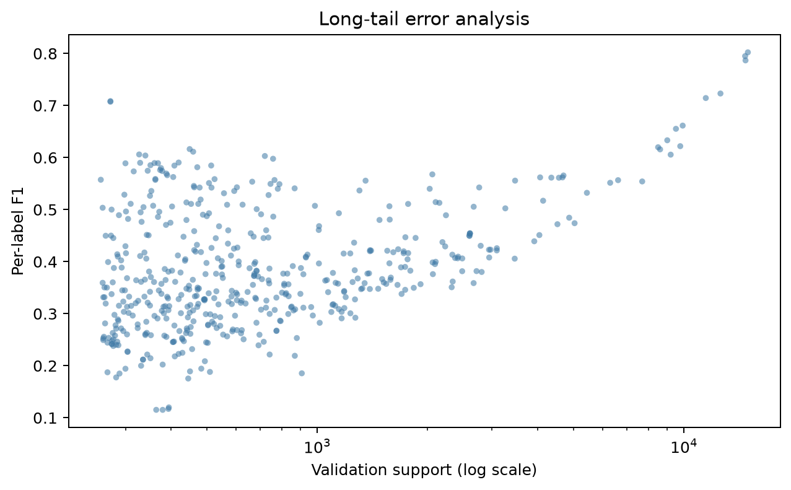

# 蛋白质功能预测：基于 k-mer 表征、类别不平衡学习与稳健阈值优化的多标签分类

## 分析结果概要

本项目针对 113,796 条带标注蛋白质序列和 28,450 条测试序列，构建 500 个功能标签的多标签分类系统。评价指标为逐标签 F1 的宏平均，因此稀有标签与阈值校准对最终得分具有决定性影响。我们在严格不使用外部训练数据和预训练权重的前提下，比较氨基酸组成、二肽与理化统计特征、字符级 3 至 5-mer TF-IDF、随机森林、线性分类器以及从零训练的轻量一维卷积神经网络。最终方案采用 120,000 维 3 至 5-mer TF-IDF、带类别平衡的 SGD 逻辑损失分类器，并将正则系数优化为 5×10^-6。针对固定阈值造成的过预测问题，设计逐标签阈值搜索和基于标签支持度的阈值收缩，并通过双向交叉拟合评估泛化性能。最终模型的 500 标签交叉拟合 Macro F1 为 0.379956，相比随机森林基线 0.204983 提升 85.4%，相比阶段 5 主模型 0.293085 提升 29.6%。在全部训练数据上重训后生成 28,450 行、501 列的正式提交文件，并通过列顺序、ID、数据类型、空值和二值性自动校验。

关键词：蛋白质功能预测；多标签分类；k-mer；TF-IDF；类别不平衡；阈值优化

## 第一章  目标说明

蛋白质功能由氨基酸序列、结构域组合、亚细胞定位和进化关系共同决定。UniProt 与 Gene Ontology 为蛋白质功能注释提供了知识基础[1-2]，CAFA 系列评测则系统展示了计算功能预测的进展与难点[3-5]。实验验证成本高、周期长，自动化序列功能预测可为注释和候选筛选提供有效支持。本赛题将高频功能术语映射为 `label_0` 至 `label_499`，要求根据一条蛋白质序列同时判断多个标签。

项目目标包括：第一，建立可复现、可审计的数据读取、划分、训练、评估和提交流程；第二，在不引入外部数据的条件下提升 500 标签 Macro F1；第三，针对长尾分布和不同标签概率尺度设计稳健阈值；第四，生成满足官方格式的全量测试集提交文件和规范分析报告。方法设计综合参考了深度蛋白质功能预测、蛋白质语言模型、经典分类器、多标签学习、分层抽样、阈值优化、随机梯度下降、TF-IDF、评价指标和机器学习软件工程等研究[6-22]。

## 第二章  理论基础

### 2.1 多标签分类与 Macro F1

设第 j 个标签的真阳性、假阳性和假阴性分别为 TP_j、FP_j 和 FN_j，则 F1_j = 2TP_j / (2TP_j + FP_j + FN_j)。官方指标对评估子集中存在正样本的标签求算术平均。Macro F1 对每个标签赋予相同权重，因此高频标签不能掩盖稀有标签上的错误。

### 2.2 k-mer 与 TF-IDF

长度为 k 的连续氨基酸片段称为 k-mer。字符级 n-gram 能表示局部保守模式和短基序，同时规避固定序列长度。TF-IDF 抑制在多数序列中普遍出现的片段，提高具有区分度的局部模式权重。筛选实验表明 30,000 维词表仍存在明显的信息截断，最终扩展至 120,000 维并始终使用 float32 稀疏矩阵。

### 2.3 类别不平衡与阈值

训练集总体标签密度仅约 5.08%，不同标签的正例数差异显著。`class_weight="balanced"` 能提高稀有标签的训练权重，但也会使概率整体偏高。最终模型在固定 0.5 阈值下平均预测 34.13 个标签，而真实平均为 25.54 个。逐标签阈值可适应不同概率尺度，但直接在同一验证集优化会过拟合。因此使用双向交叉拟合评估，并按标签支持度将阈值向统一阈值收缩。

## 第三章  解决方案

整体流程为：数据审计与多标签分层划分；建立随机森林和 k-mer 线性基线；扫描类别权重、正则强度和特征组合；训练 CUDA CNN 作为结构差异明显的候选；进行阈值交叉拟合、标签共现后处理和分数融合；选择主模型；在全部训练数据上重训并生成提交。

最终主模型的关键参数如下：字符级 3 至 5-mer；`min_df=5`；最大词表 120,000；次线性 TF；SGD 逻辑损失；`class_weight="balanced"`；`alpha=5×10^-6`；最大迭代 50；随机种子 42。最终阈值由完整验证集拟合，但模型选择分数来自双向交叉拟合，避免把拟合分数误当作无偏结果。

## 第四章  特征选择与方法

### 4.1 统计特征

基础统计包括 20 种标准氨基酸频率和 `log1p` 序列长度。扩展统计加入 400 维二肽频率、疏水/极性/正电/负电/芳香/小残基比例以及 6 个长度分桶，共 433 维。前 50 标签筛选中，扩展统计特征经阈值优化后的 Macro F1 为 0.411159，低于同口径 k-mer 模型的 0.467430。

### 4.2 k-mer 线性模型

3 至 5-mer 比单独 3-mer 在筛选实验中提升约 0.010。LogisticRegression 与 SGD 得分接近，但前者耗时明显更高。第一轮使用按支持度等距抽取的 100 标签重新筛选，30,000 维词表下将正则系数由 5×10^-5 降至 7×10^-6，交叉拟合得分从 0.311967 提升至 0.345899；随后将词表扩展至 120,000 维并采用 `alpha=5×10^-6`，进一步达到 0.372594。

### 4.3 CUDA CNN

为合理使用 GPU，在 E 盘 CUDA 环境中从零训练轻量一维 CNN。模型采用 32 维氨基酸嵌入、核宽 3/7/15 的三路卷积、每路 64 通道、全局最大池化和 500 维输出。序列首尾截断至 1,024，训练 3 个 epoch，使用混合精度和平方根正例权重。该模型不使用外部预训练权重，训练仅需 32.69 秒，但阈值交叉拟合 Macro F1 为 0.184126，表明轻量从零训练不足以学习复杂功能语义。

### 4.4 标签相关性与融合

仅使用训练折标签构建正向条件共现矩阵，分别以 0.02、0.05 和 0.10 权重传播预测分数；同时测试 CNN 权重为 0.05、0.10 和 0.20 的连续分数融合。所有权重仅依据本地交叉拟合选择。阶段 6 的最佳标签共现后处理为 0.316806，最佳 CNN 融合为 0.316245，均低于当时的 30,000 维主模型 0.317516，因此最终提交不采用融合。

## 第五章  数据整理

训练集包含 113,796 行、502 列；测试集包含 28,450 行、2 列；提交应包含 `protein_id` 和 500 个标签列。训练和测试均无缺失值与重复 ID。除 20 种标准氨基酸外还包含少量 B、O、U、X、Z；统计特征将其保留在长度分母中，k-mer 特征直接按字符建模。

验证使用固定 seed 42 的多标签分层划分：90,920 条训练、22,876 条验证。训练/验证 ID 固化到 `artifacts/metrics/splits/seed42/`，所有模型共享同一划分。阈值评估再将验证集随机等分为校准折和留出折，并交换两折执行双向交叉拟合。

## 第六章  探索性数据分析

标签总体密度约 5.08%；每条训练序列平均有 25.42 个标签，中位数 17，最大 273。序列长度均值 553.19，中位数 410，最大 35,375，呈明显右偏。标签频率具有长尾特征，稀有标签与高频标签在最佳阈值和误差模式上差异显著。

已有图表包括标签长尾、训练/测试序列长度和每序列标签数分布。模型误差分析进一步显示，支持度较高的标签通常具有更高 F1，但部分低频标签仍可由强局部 k-mer 模式得到较好识别，说明支持度不是唯一决定因素。

## 第七章  模型评估

### 7.1 模型对比

随机森林基线 Macro F1 为 0.204983；阶段 5 的 3 至 5-mer SGD 与收缩阈值为 0.293085；30,000 维低正则模型达到 0.317516。第一轮进一步扩大词表并降低正则，固定阈值 0.5 已达到 0.362882，逐标签收缩阈值后达到 0.379956，说明模型排序能力与阈值策略均贡献了增益。

表7.1  模型性能对比

| 模型 | 标签数 | 评估方式 | Macro F1 |
| --- | ---: | --- | ---: |
| 120k 3-5-mer SGD + 收缩阈值 | 500 | 双向交叉拟合 | 0.379956 |
| 低正则 3-5-mer SGD + 收缩阈值 | 500 | 双向交叉拟合 | 0.317516 |
| 阶段 5 3-5-mer SGD + 收缩阈值 | 500 | 双向交叉拟合 | 0.293085 |
| 随机森林基线 | 500 | 固定验证、阈值 0.5 | 0.204983 |
| CUDA CNN + 收缩阈值 | 500 | 双向交叉拟合 | 0.184126 |

### 7.2 阈值策略

在未参与阈值选择的留出折上，固定 0.5、统一阈值、逐标签阈值和逐标签收缩阈值的 Macro F1 分别为 0.365663、0.372351、0.380334 和 0.381480。双向交叉拟合结果为 0.379956。五个阈值二分 seed 的细网格均值为 0.380168、标准差为 0.000541，表明收缩阈值收益稳定。

表7.2  阈值策略对比

| 阈值策略 | 校准折 Macro F1 | 留出折 Macro F1 | 留出预测正例率 |
| --- | ---: | ---: | ---: |
| 固定 0.5 | 0.359727 | 0.365663 | 6.827% |
| 统一阈值 | 0.367392 | 0.372351 | 4.876% |
| 逐标签阈值 | 0.387097 | 0.380334 | 5.821% |
| 逐标签收缩阈值 | 0.384958 | 0.381480 | 5.846% |

固定 0.5 平均预测 34.13 个标签，统一阈值降低至 24.38 个，逐标签收缩阈值为 29.23 个，已明显接近真实均值 25.54。

### 7.3 误差分析

长尾标签 F1 波动较大，主要错误来自概率校准不稳定、局部序列模式不足以确定功能，以及一个蛋白质可能同时属于多个相关功能。外部预训练蛋白语言模型可能改善远程依赖和语义表征，但现有规则未明确允许外部权重，因此本项目没有使用。

## 第八章  数据分析发现与结论

第一，在本数据规模上，稀疏 k-mer 线性模型优于低维统计特征和轻量从零 CNN，且训练成本可控。第二，类别平衡虽然提高稀有标签召回，却造成明显过预测，必须配合阈值校准。第三，统一阈值已能获得显著提升，逐标签阈值进一步改善 Macro F1；支持度收缩使该收益在交叉拟合中保持稳定。第四，简单标签共现传播和弱 CNN 融合未带来收益，说明不同模型之间的分数尺度和误差结构需要更精细的校准。

最终主模型为 120,000 维 3 至 5-mer TF-IDF + balanced SGD (`alpha=5×10^-6`) + 逐标签收缩阈值。500 标签双向交叉拟合 Macro F1 为 0.379956。系统已在全部 113,796 条训练数据上重训，并生成完整测试提交与元数据。当前剩余人工事项包括竞赛平台上传与线上分数回填，以及继续验证更大或分块 k-mer 词表能否带来第二轮增益。

## 参考文献

[1] The UniProt Consortium. UniProt: the Universal Protein Knowledgebase in 2023[J]. Nucleic Acids Research, 2023, 51(D1): D523-D531.

[2] The Gene Ontology Consortium. The Gene Ontology knowledgebase in 2023[J]. Genetics, 2023, 224(1): iyad031.

[3] Radivojac P, Clark W T, Oron T R, et al. A large-scale evaluation of computational protein function prediction[J]. Nature Methods, 2013, 10: 221-227.

[4] Jiang Y, Oron T R, Clark W T, et al. An expanded evaluation of protein function prediction methods shows an improvement in accuracy[J]. Genome Biology, 2016, 17: 184.

[5] Zhou N, Jiang Y, Bergquist T R, et al. The CAFA challenge reports improved protein function prediction and new functional annotations for hundreds of genes through experimental screens[J]. Genome Biology, 2019, 20: 244.

[6] Kulmanov M, Khan M A, Hoehndorf R. DeepGO: predicting protein functions from sequence and interactions using a deep ontology-aware classifier[J]. Bioinformatics, 2018, 34(4): 660-668.

[7] Kulmanov M, Hoehndorf R. DeepGOPlus: improved protein function prediction from sequence[J]. Bioinformatics, 2020, 36(2): 422-429.

[8] You R, Yao S, Xiong Y, et al. NetGO: improving large-scale protein function prediction with massive network information[J]. Nucleic Acids Research, 2019, 47(W1): W379-W387.

[9] Gligorijevic V, Renfrew P D, Kosciolek T, et al. Structure-based protein function prediction using graph convolutional networks[J]. Nature Communications, 2021, 12: 3168.

[10] Cao Y, Shen Y. TALE: transformer-based protein function annotation with joint sequence-label embedding[J]. Bioinformatics, 2021, 37(18): 2825-2833.

[11] Elnaggar A, Heinzinger M, Dallago C, et al. ProtTrans: Toward understanding the language of life through self-supervised learning[J]. IEEE Transactions on Pattern Analysis and Machine Intelligence, 2022, 44(10): 7112-7127.

[12] Rives A, Meier J, Sercu T, et al. Biological structure and function emerge from scaling unsupervised learning to 250 million protein sequences[J]. Proceedings of the National Academy of Sciences, 2021, 118(15): e2016239118.

[13] Lin Z, Akin H, Rao R, et al. Evolutionary-scale prediction of atomic-level protein structure with a language model[J]. Science, 2023, 379(6637): 1123-1130.

[14] Breiman L. Random forests[J]. Machine Learning, 2001, 45: 5-32.

[15] Read J, Pfahringer B, Holmes G, Frank E. Classifier chains for multi-label classification[J]. Machine Learning, 2011, 85: 333-359.

[16] Sechidis K, Tsoumakas G, Vlahavas I. On the stratification of multi-label data[C]//Machine Learning and Knowledge Discovery in Databases. Berlin: Springer, 2011: 145-158.

[17] Lipton Z C, Elkan C, Naryanaswamy B. Optimal thresholding of classifiers to maximize F1 measure[C]//Machine Learning and Knowledge Discovery in Databases. Berlin: Springer, 2014: 225-239.

[18] Bottou L. Large-scale machine learning with stochastic gradient descent[C]//Proceedings of COMPSTAT. Heidelberg: Physica-Verlag, 2010: 177-186.

[19] Salton G, Buckley C. Term-weighting approaches in automatic text retrieval[J]. Information Processing & Management, 1988, 24(5): 513-523.

[20] Tsoumakas G, Katakis I. Multi-label classification: An overview[J]. International Journal of Data Warehousing and Mining, 2007, 3(3): 1-13.

[21] Sokolova M, Lapalme G. A systematic analysis of performance measures for classification tasks[J]. Information Processing & Management, 2009, 45(4): 427-437.

[22] Pedregosa F, Varoquaux G, Gramfort A, et al. Scikit-learn: Machine learning in Python[J]. Journal of Machine Learning Research, 2011, 12: 2825-2830.
